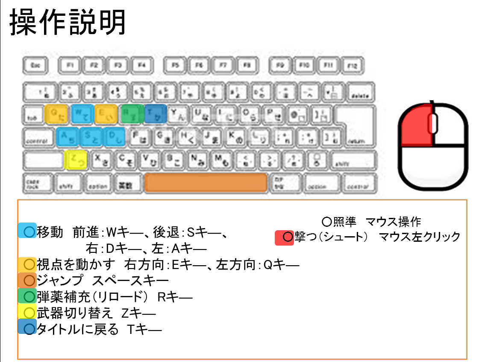

# プラ箱戦記
ジャンル「3DアクションFPS」

制作期間：約４ヵ月

制作時期：平成25年9月頃から

## ソース・ヘッダーファイルと簡単な説明
- **camera.h/cpp**  
カメラ情報の管理

- **graphic.h/.cpp**  
オブジェクトの表示などに使う関数を用意

- **HitCheck.h/.cpp**  
当たり判定関数

- **input.h/.cpp**  
キーボードでの入力受付

- **main.h/.cpp**  
メインルーチン、メッセージ処理

- **object.h/.cpp**  
ステージやアイテム用処理

- **player.h/.cpp**  
プレイヤーの主な処理

- **shot.h/.cpp**  
発射される弾の処理

- **game.h/.cpp**  
メインゲームの制御

- **scene.h/.cpp**  
タイトル、メインゲーム、リザルトのシーン遷移の管理

- **Lib.h**  
プリプロ関連ヘッダーファイル、多用する定数など

## 最も工夫した箇所
### HitCheck.cpp
SegmentHitcheck関数とIntersectSegmentTriangle関数とPolygonSideCheck関数、「graphic.cpp」のLocalToWarldTransform関数、  
「game.cpp」のPasteBulletHoles関数です。

最初は当たり判定BoxImpact関数というもので取っていたのですが、線分とモデルの頂点座標を用いてより正確にしようと思い、改良しました。  
LocalToWarldTransform関数で予め取得したモデルの各頂点座標をワールド座標に変換しSegmentHitcheck関数内で配列に並べて、IntersectSegmentTriangle関数で判定と線分とポリゴンとの交点を取れるようにしました。  
この辺りは何度も試行錯誤しました。PasteBulletHoles関数で交点を元に弾痕のモデルをキャラクターのモデルにピッタリ張り付くように配置しています。ここの配置は本当に苦労しました。しかし完成した時はとても嬉しく、成し遂げたと思いました。「HitCheck.cpp」と「game.cpp」の上記部分は是非見て下さい！

### player.cpp
ShotControl関数です。弾の発射タイミングの制御に力を入れました。カウンタを使い連射速度やバースト射撃を表現しました。ここは企画者からの指示は特に無かった為、ミリタリー好きな私のこだわりが伝わればと思います。

### graphic.cpp
CalcScreenToXZ関数です。逆行列を用いて、弾の発射する方角をマウスでゲーム画面上を指した所で決める為、スクリーン座標をワールド座標に変換しています。

## この時の制作について
この作品が初めての3Dゲーム制作でした。チーム内で3Dの勉強を始めていたのは私だけでしたので、作業分担には頭を抱える様な事ばかりでした。参考書を頼りに、大まかなライブラリを作成し、その当時の自分の精一杯の力で作っていました。  
作業量的にどうしても組み込めなかった線分とポリゴンの当たり判定も、制作終了後に組み込むことが出来ました。

## 操作説明
### タイトル
基本マウス操作になります。  
「GAME START」をクリックするとゲームが始まります。  
「GAME END」をクリックするとゲームが終了します。

### 戦闘中
基本操作はこちらの画像を御覧ください  

数字キー１～４：サブ武器種類変更
